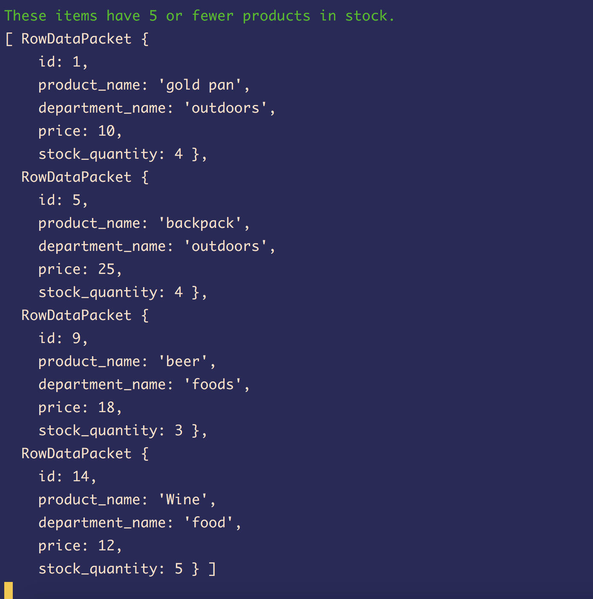
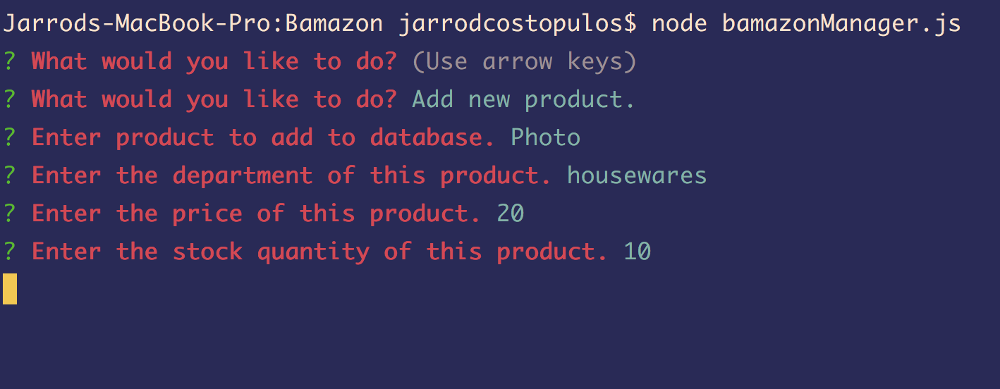
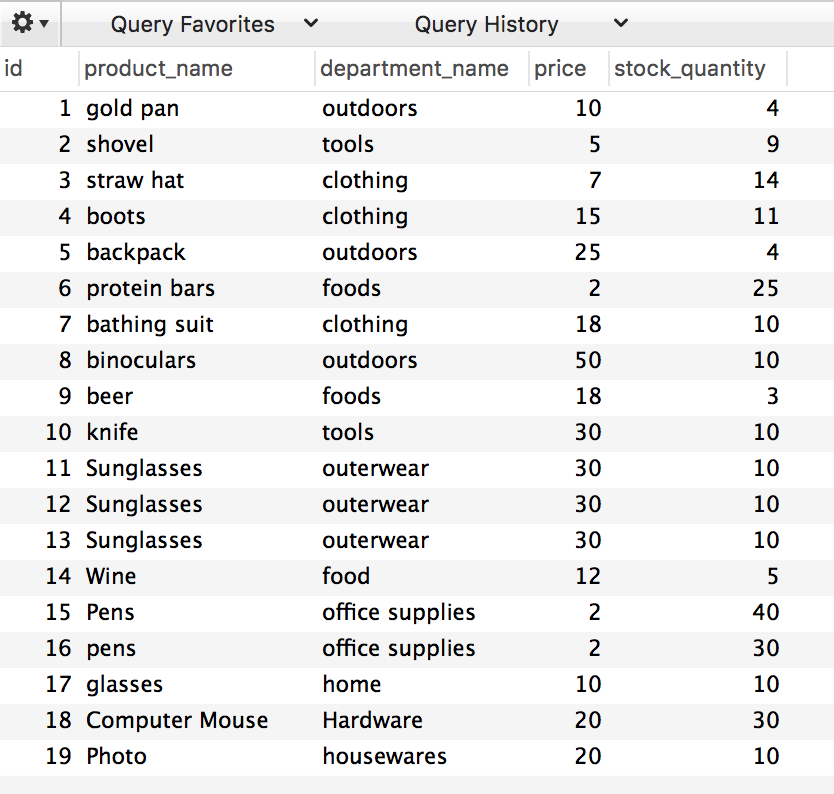

# Bamazon
node.js app for database manipulation

Below is a sampling of how the app will operate. 

The customer app shows table data and query's

The second choice

And the result

Here is a sample of the Manager app (choosing low inventory)

And the results are displayed

Here we will add a new Item

And the updated database

